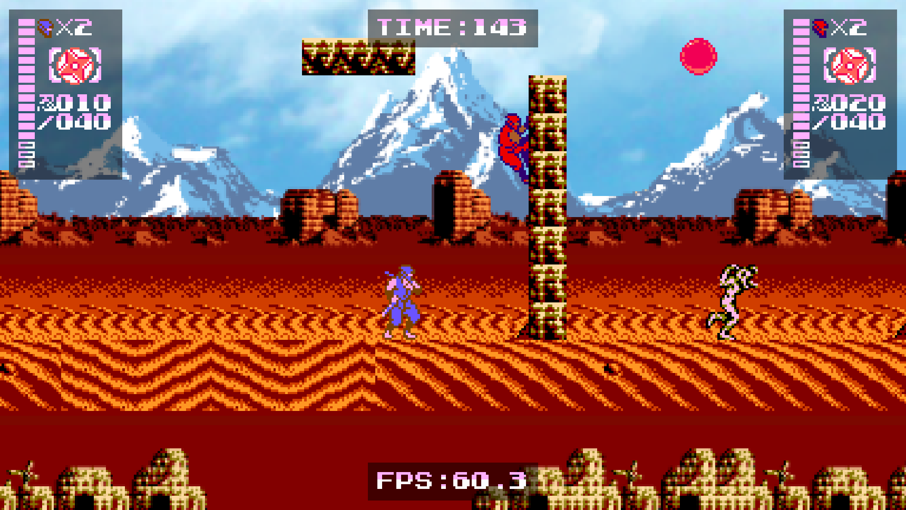

# Ninja Gaiden 3½ Prototype

Prototype Remake of NES' Ninja Gaiden III using HTML5 (Phaser 3 + TypeScript)

## Disclaimer

This project is for educational and non-commercial purposes only*. It includes assets from the original game developed by TECMO in 1991.

Initially, it does not aim to recreate the entire game, but I intend to complete at least all of Act II, all the way up to the Boss Battle.

This project utilizes Phaser 3 Game Engine, which works as an abstraction layer for graphics, sound and input, and make a game that relies only on HTML5 standard technologies.

\* _"Educational purposes" meaning: teach myself some TypeScript, and how to write a side-scrolling platformer with local multiplayer._ 

---

## Screenshots

---

## Live demo 

You can play the live demo hosted at http://arka.digital/Ninja

---

## Base Projects

* Phaser (HTML5 Game Framework): https://github.com/photonstorm/phaser
* Phaser 3 TypeScript Starter: https://github.com/geocine/phaser3-rollup-typescript

---

## Features

* UI and gameplay adapted for Widescreen display.
* Local co-operative multiplayer (up to 4 players).
* Control methods: Keyboard, gamepad and touch screen (virtual pad).

---

## Completion Status

* Level 2-1, without progress to Level 2-2 yet. Not all enemy types, and no power-up abilities.

---

## How to Build and Run

(All instructions below taken "as is" from the base "Phaser 3 TypeScript Start" project):

### Available Commands

| Command | Description |
|---------|-------------|
| `yarn install` | Install project dependencies |
| `yarn dev` | Builds project and open web server, watching for changes |
| `yarn build` | Builds code bundle with production settings  |
| `yarn serve` | Run a web server to serve built code bundle |

### Development

After cloning the repo, run `yarn install` from your project directory. Then, you can start the local development
server by running `yarn dev` and navigate to http://localhost:3000.

### Production

After running `yarn build`, the files you need for production will be on the `dist` folder. To test code on your `dist` folder, run `yarn serve` and navigate to http://localhost:5000

---

## TO-DO List

* Sound effects and music.
* Menus in Title Screen for button remapping and control method selection.
* Implement all enemies required.
* Implement all power-up abilities.
* Improve loading time and JavaScript bundle size; Implement loading screen.

---

## Pending bugfixes

* [Gameplay] Quicksand does no damage to players, and if player sinks all the way, it will fall out of game world's edge.
* [Graphics] When using WebGL renderer, some browsers may present "tile bleeding" (a sort of flickering) in the level's tiles. This is discusssed in https://stackoverflow.com/questions/62936847/how-do-i-stop-my-tiles-from-bleeding-when-using-a-tilemap-in-phaser-3
* [Touchscreen] Improve the on-screen button to go to full screen; it is clumsy and requires too many touches (tested on an Android phone).
* [Gameplay] Ninja will jump and slash repeatedly if you hold down the respective action buttons. Improve to properly detect and handle button presses.
* [Gameplay] Ninja will not be knocked back if colliding with an enemy while on the ground, only in the air.
* [Co-Op] Smoother camera movement when of the players is KO'ed.
* [Code] Improve resource management: Review objects and scenes' lifecycles and profile memory usage.